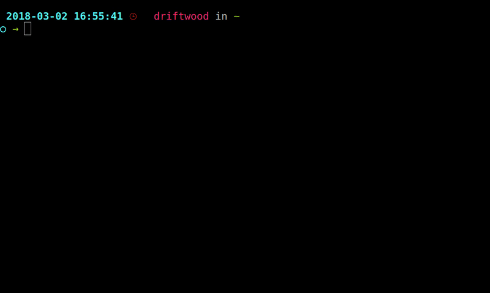

<p align="center">
<b><a href="#getting-started">Getting Started</a></b>
|
<b><a href="#downloads">Download</a></b>
|
<b><a href="#known-issues">Known Issues</a></b>
|
<b><a href="#filing-issues--feature-requests">Bugs/Feature Requests</a></b>
|
<b><a href="#plugin-development">Plugin Development</a></b>
|
<b><a href="#contributing--build-instructions">Contributing</a></b>
</p>


# Cloud Foundry CLI

[](https://github.com/cloudfoundry/cli/releases/latest)
[](https://docs.cloudfoundry.org/cf-cli)
[](https://cli.cloudfoundry.org)
[](https://slack.cloudfoundry.org)
[](https://github.com/cloudfoundry/cli/blob/master/LICENSE)

***Cloud Foundry CLI*** is the official command line client for [Cloud Foundry](https://cloudfoundry.org).
Latest help of each command is [here](https://cli.cloudfoundry.org) (or run `cf help`);

Currently, there are two versions of the cf CLI in development: 
- the supported v6 cf CLI. See [here](https://docs.cloudfoundry.org/cf-cli) for more information. 
- v7 beta cf CLI which is currently in development and will be in beta mode until it is completely backed by the [v3 API](http://v3-apidocs.cloudfoundry.org/version/3.75.0/index.html). See [here](https://docs.cloudfoundry.org/cf-cli/v7.html) for more information. 


**Important Note**: The v6 CF CLI supports as far back as CF Release v284/CF Deployment v1.7.0 (CAPI Release: 1.46.0 (APIs 2.100.0 and 3.35.0). See our [wiki](https://github.com/cloudfoundry/cli/wiki/Versioning-Policy#cf-cli-minimum-supported-version) for more information. If you are on an older version of CF Release, we recommend you upgrade to a supported version. 

**Important Note**: The v7 CF CLI beta under rapid development and as such is tested only against CC API v3 Release Candidate.

If you have any questions, ask away on the #cli channel in [our Slack
community](https://slack.cloudfoundry.org/) and the
[cf-dev](https://lists.cloudfoundry.org/archives/list/cf-dev@lists.cloudfoundry.org/)
mailing list, or [open a GitHub issue](https://github.com/cloudfoundry/cli/issues/new).  You can follow our development progress
on [Core CF CLI Pivotal Tracker](https://www.pivotaltracker.com/n/projects/892938) or [v3/v7 CLI VAT Pivotal Tracker](https://www.pivotaltracker.com/n/projects/2196383).

## Getting Started

Download and install the cf CLI from the [Downloads Section](#downloads) for either the [v6 cf CLI](https://github.com/cloudfoundry/cli/blob/master/README.md#downloading-the-v6-cli) or the [v7 beta cf CLI](https://github.com/cloudfoundry/cli/blob/master/README.md#downloading-the-v7-cli). 

Once installed, you can log in and push an app.



Check out our [community contributed CLI plugins](https://plugins.cloudfoundry.org) to further enhance your CLI experience.

## Downloads

### Downloading the V6 CLI

#### Installing using a package manager

**Mac OS X** and **Linux** using [Homebrew](https://brew.sh/) via the [cloudfoundry tap](https://github.com/cloudfoundry/homebrew-tap):

```sh
brew install cloudfoundry/tap/cf-cli
```

**Note:** `cf` tab completion requires `bash-completion` to be installed properly in order to work.

**Debian** and **Ubuntu** based Linux distributions:

```sh
# ...first add the Cloud Foundry Foundation public key and package repository to your system
wget -q -O - https://packages.cloudfoundry.org/debian/cli.cloudfoundry.org.key | sudo apt-key add -
echo "deb https://packages.cloudfoundry.org/debian stable main" | sudo tee /etc/apt/sources.list.d/cloudfoundry-cli.list
# ...then, update your local package index, then finally install the cf CLI
sudo apt-get update
sudo apt-get install cf-cli
```

**Enterprise Linux** and **Fedora** systems (RHEL6/CentOS6 and up):
```sh
# ...first configure the Cloud Foundry Foundation package repository
sudo wget -O /etc/yum.repos.d/cloudfoundry-cli.repo https://packages.cloudfoundry.org/fedora/cloudfoundry-cli.repo
# ...then, install the cf CLI (which will also download and add the public key to your system)
sudo yum install cf-cli
```

#### Installers and compressed binaries

| | Mac OS X 64 bit | Windows 64 bit | Linux 64 bit |
| :---------------: | :---------------: |:---------------:| :------------:|
| Installers | [pkg](https://packages.cloudfoundry.org/stable?release=macosx64&source=github) | [zip](https://packages.cloudfoundry.org/stable?release=windows64&source=github) | [rpm](https://packages.cloudfoundry.org/stable?release=redhat64&source=github) / [deb](https://packages.cloudfoundry.org/stable?release=debian64&source=github) |
| Binaries | [tgz](https://packages.cloudfoundry.org/stable?release=macosx64-binary&source=github) | [zip](https://packages.cloudfoundry.org/stable?release=windows64-exe&source=github) | [tgz](https://packages.cloudfoundry.org/stable?release=linux64-binary&source=github) |

Release notes, and 32 bit releases can be found [here](https://github.com/cloudfoundry/cli/releases).

**Download examples** with curl for Mac OS X and Linux binaries
```sh
# ...download & extract Mac OS X binary
curl -L "https://packages.cloudfoundry.org/stable?release=macosx64-binary&source=github" | tar -zx
# ...or Linux 64-bit binary
curl -L "https://packages.cloudfoundry.org/stable?release=linux64-binary&source=github" | tar -zx
# ...move it to /usr/local/bin or a location you know is in your $PATH
mv cf /usr/local/bin
# ...copy tab completion file on Ubuntu (takes affect after re-opening your shell)
sudo curl -o /usr/share/bash-completion/completions/cf https://raw.githubusercontent.com/cloudfoundry/cli/master/ci/installers/completion/cf
# ...and to confirm your cf CLI version
cf --version
```

##### Edge binaries
Edge binaries are *not intended for wider use*; they're for developers to test new features and fixes as they are 'pushed' and passed through the CI.
Follow these download links for [Mac OS X 64 bit](https://packages.cloudfoundry.org/edge?arch=macosx64&source=github), [Windows 64 bit](https://packages.cloudfoundry.org/edge?arch=windows64&source=github) and [Linux 64 bit](https://packages.cloudfoundry.org/edge?arch=linux64&source=github).

---------------------------------------


### Downloading the V7 beta CLI

**Important Note**: The v7 CF CLI beta under rapid development and as such is tested only against CC API v3 Release Candidate. Use at your own risk. See [releases](https://github.com/cloudfoundry/cli/releases) for more information. 

#### Compatibility
The V7 CLI is developed and tested against CAPI release candidates. See the [releases](https://github.com/cloudfoundry/cli/releases) page for the minimum CAPI RC version required for each V7 beta version.

#### Installing using a package manager

**Mac OS X** and **Linux** using [Homebrew](https://brew.sh/) via the [cloudfoundry tap](https://github.com/cloudfoundry/homebrew-tap):

```sh
brew install cloudfoundry/tap/cf7-cli
```

**Note:** `cf7` tab completion requires `bash-completion` to be installed properly in order to work.

**Debian** and **Ubuntu** based Linux distributions:

```sh
# ...first add the Cloud Foundry Foundation public key and package repository to your system
wget -q -O - https://packages.cloudfoundry.org/debian/cli.cloudfoundry.org.key | sudo apt-key add -
echo "deb https://packages.cloudfoundry.org/debian stable main" | sudo tee /etc/apt/sources.list.d/cloudfoundry-cli.list
# ...then, update your local package index, then finally install the cf CLI
sudo apt-get update
sudo apt-get install cf7-cli
```

**Enterprise Linux** and **Fedora** systems (RHEL6/CentOS6 and up):
```sh
# ...first configure the Cloud Foundry Foundation package repository
sudo wget -O /etc/yum.repos.d/cloudfoundry-cli.repo https://packages.cloudfoundry.org/fedora/cloudfoundry-cli.repo
# ...then, install the cf CLI (which will also download and add the public key to your system)
sudo yum install cf7-cli
```


#### Installers and compressed binaries

| | Mac OS X 64 bit | Windows 64 bit | Linux 64 bit |
| :---------------: | :---------------: |:---------------:| :------------:|
| Installers |[pkg](https://packages.cloudfoundry.org/stable?release=macosx64&version=v7&source=github) | [zip](https://packages.cloudfoundry.org/stable?release=windows64&version=v7&source=github)| [rpm](https://packages.cloudfoundry.org/stable?release=redhat64&version=v7&source=github) / [deb](https://packages.cloudfoundry.org/stable?release=debian64&version=v7&source=github) |
| Binaries | [tgz](https://packages.cloudfoundry.org/stable?release=macosx64-binary&version=v7&source=github) | [zip](https://packages.cloudfoundry.org/stable?release=windows64-exe&version=v7&source=github) | [tgz](https://packages.cloudfoundry.org/stable?release=linux64-binary&version=v7&source=github) |

Release notes, and 32 bit releases can be found [here](https://github.com/cloudfoundry/cli/releases).

**Download examples** with curl for Mac OS X and Linux binaries
```sh
# ...download & extract Mac OS X binary
curl -L "https://packages.cloudfoundry.org/stable?release=macosx64-binary&version=v7&source=github" | tar -zx
# ...or Linux 64-bit binary
curl -L "https://packages.cloudfoundry.org/stable?release=linux64-binary&version=v7&source=github" | tar -zx
# ...move it to /usr/local/bin or a location you know is in your $PATH
mv cf7 /usr/local/bin
# ...copy tab completion file on Ubuntu (takes affect after re-opening your shell)
sudo curl -o /usr/share/bash-completion/completions/cf7 https://raw.githubusercontent.com/cloudfoundry/cli/master/ci/installers/completion/cf7
# ...and to confirm your cf CLI version
cf7 --version
```

##### Edge binaries
Edge binaries are *not intended for wider use*; they're for developers to test new features and fixes as they are 'pushed' and passed through the CI.
Follow these download links for [Mac OS X 64 bit](https://packages.cloudfoundry.org/edge?arch=macosx64&version=v7&source=github), [Windows 64 bit](https://packages.cloudfoundry.org/edge?arch=windows64&version=v7&source=github) and [Linux 64 bit](https://packages.cloudfoundry.org/edge?arch=linux64&version=v7&source=github).


## Known Issues

* On Windows in Cygwin and Git Bash, interactive password prompts (in `cf login`) do not work ([issue #171](https://github.com/cloudfoundry/cli/issues/171)). Please use alternative commands (non-interactive authentification `cf auth` or `cf api` instead of `cf login`) to work around this. Or, use the Windows `cmd` command line.
* On Windows, `cf ssh` may not display correctly if the `TERM` is not set. We've found that setting `TERM` to `msys` fixes some of these issues.
* On Windows, `cf ssh` will hang when run from the MINGW32 or MINGW64 shell. A workaround is to use PowerShell instead.
* CF CLI/GoLang do not use OpenSSL. Custom/Self Signed Certificates need to be [installed in specific locations](https://docs.cloudfoundry.org/cf-cli/self-signed.html) in order to `login`/`auth` without `--skip-ssl-validation`.
* API tracing to terminal (using `CF_TRACE=true`, `-v` option or `cf config --trace`) doesn't work well with some CLI plugin commands. Trace to file works fine. On Linux, `CF_TRACE=/dev/stdout` works too. See [this Diego-Enabler plugin issue](https://github.com/cloudfoundry-attic/Diego-Enabler/issues/6) for more information.
* .cfignore used in `cf push` must be in UTF-8 encoding for CLI to interpret correctly. ([issue #281](https://github.com/cloudfoundry/cli/issues/281#issuecomment-65315518))
* On Linux, when encountering message "bash: .cf: No such file or directory", ensure that you're using the [correct binary or installer for your architecture](https://askubuntu.com/questions/133389/no-such-file-or-directory-but-the-file-exists).

## Filing Issues & Feature Requests

First, update to the [latest cli](https://github.com/cloudfoundry/cli/releases)
and try the command again.

If the error remains or feature still missing, check the [open issues](https://github.com/cloudfoundry/cli/issues) and if not already raised please file a new issue with the requested details.

## Plugin Development

The CF CLI supports external code execution via the plugins API. For more
information follow:

* [The CF CLI plugin development guide](https://github.com/cloudfoundry/cli/tree/master/plugin/plugin_examples)
* [The official plugins repository](https://plugins.cloudfoundry.org/)

When importing the plugin code use `import "code.cloudfoundry.org/cli/plugin"`.
Older plugins that import `github.com/cloudfoundry/cli/plugin` will still work
as long they vendor the plugins directory.

## Contributing & Build Instructions

Please read the [contributors' guide](.github/CONTRIBUTING.md)

If you'd like to submit updated translations, please see the [i18n README](https://github.com/cloudfoundry/cli/blob/master/cf/i18n/README-i18n.md) for instructions on how to submit an update.


